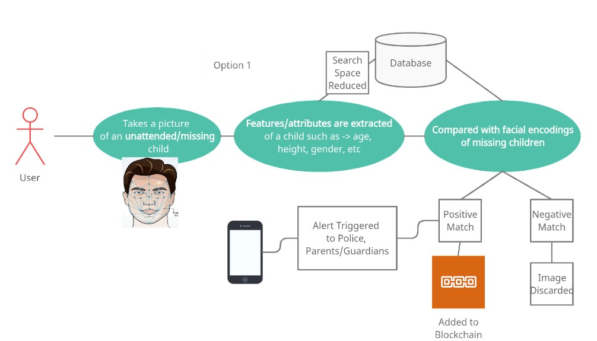
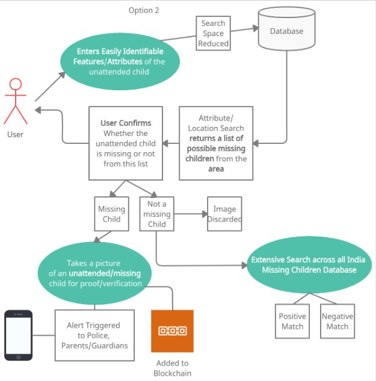
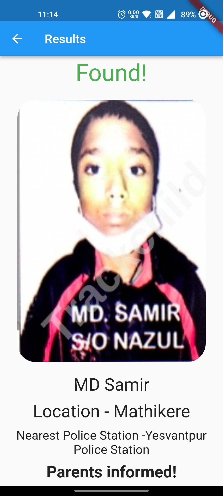
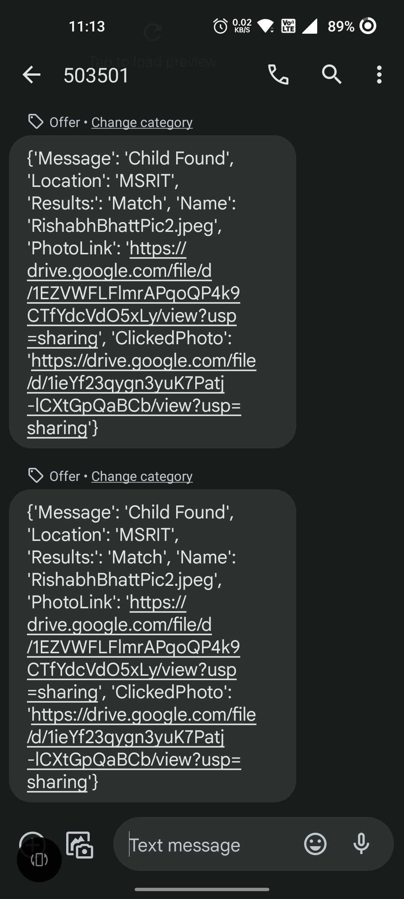

# Gumshudha App

## Idea/Approach Details

1. We are introducing the Gumshuda App used for the Identification of Missing Children via the Deep Learning Model that extracts the facial features from a photo and compares them with existing features from the missing children database.
2. In addition, we use location-based proximity search for efficient search for missing children from an area. (Helps reduce the search space)
3. Captured Image Discarded to maintain privacy only in case of a negative search. However, positive/partial matches are added to the Blockchain for transparency, tracking, and authenticity of both the uploader and the user-captured image/entered data.

4. In case the face is unavailable, we introduce attribute/feature extraction that extracts key human body features such as height, age, gender, skin tone, weight, hair color, etc., using a DL Model. Finally, a list of possible missing children is returned based on this data.

## Why Blockchain?
1. It can help detectives develop a trail using the last seen locations/pictures.
2. It can help identify potential culprits using the app for unwanted activities.
3. To bring transparency into the process.

## Use cases
1. Any user can use them to identify the children missing from remote areas.
2. Parents/Guardians of the child can know the last known location of the same.
3. It helps to form a trail of locations where the children were found.
4. It can be used to classify location based on the density of True Positives, which police can use in their investigation to organize areas as safe/unsafe.

## Show Stopper
1. Effective feature search for search space optimization.
2. Feature Extraction and Comparison with effective search space reduction/optimization.
3. Transparency into the system via Blockchain.

## Screenshots of the App

